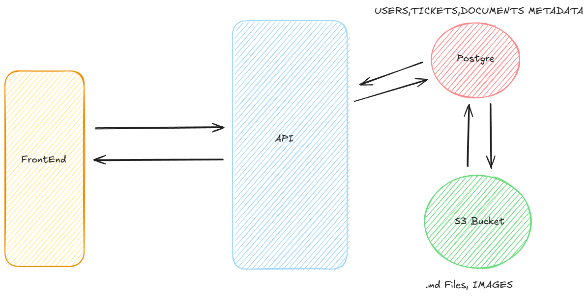

This project is a learning experience to gain more skills in the full-stack realm. I do really like tinkering with things.

## Idea
---
The purpose of this project is to create a Ticket System that replicates a SAAS setup. The goal is to improve my skills all around not just one area. I plan to do a write up at the end of this project on my substack and more than likely have some markdown files in a dir somewhere here. I already have my basic data design pages in design_pages.

The front end may eventually be deployed to Vercel but as of right now it is going to be running on my local machine. I decided to go with the workflow [GitFlow](https://www.gitkraken.com/learn/git/git-flow) for this project. Utilizing an API key, the application will call the API built in AWS, once the token matches it will make the appropriate calls to the lambda functions that will essentially be SQL POST and GET requests for the Users and Tickets tables in the Postgre database. 

## Tech
---
- Next.js
- TailwindCSS
- Jest
- AWS (Lambda, API Gateway, Cognito, S3, CloudWatch)

This list will for sure grow due to the idea of implementing a CI/CD pipeline with something like GitHub Actions then throwing Terraform into the mix.

## Goals
---
- Serverless backend functions
- Auth with JWT and API keys
- Create, Update, Delete Tickets
- Ticket create based on emails.
- CI/CD pipeline development

## What is Done
---
- ~~Setup~~
